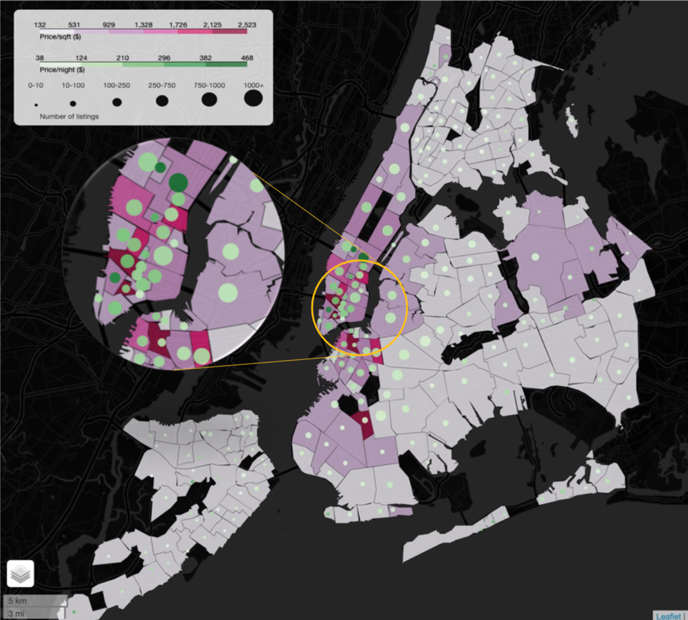
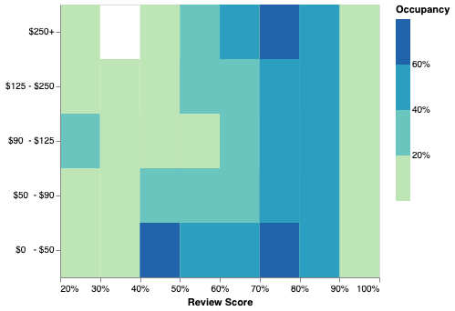
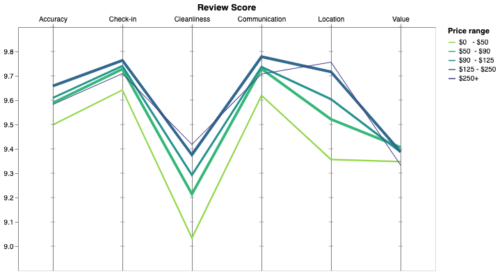

# Airbnb Analysis

A descriptive analysis focusing on finding insights through visualisation

### Buying in New York City
#### Executive summary 

Based on our initial analysis on the potential investment in joining the NYC Airbnb host community, we concluded that there are mainly three factors to consider:

1. **Best spot to enter the market:**  This map combines property prices with Airbnb prices and number of listings in order to visualise the rent potential relative to the investment and competitive landscape. 
You should consider the Theatre District & NoHo (Manhattan) and Vinegar Hill (Brooklyn), as they offer a good trade-off between cost per SQF, potential price per night, and show a low competition on Airbnb.

2. **Influencers of the Occupancy Rate:** Below chart combines Review Score, List Prices and Occupancy rates in order to investigate whether price and reviews determine Occupancy Rates. 
Unsurprisingly, ratings and price levels are significant determinants of Occupancy Rates. In terms of ratings, more so for the higher price point listings. Low priced listings have high occupancy rates independently of ratings, so it seems there is high demand for rock-bottom sleep-over facilities.
You should consider buying a property that can either command high reviews or can be rented out at a very low price.

3. **Influencers of the Review Score:** We see here the average review scores by price range. We see that the location and cleanliness are the main drivers to justify an expensive price, although people seem to think that it is not always worth it given the very low Value score given to expensive accommodations. Following on the insights gathered from the previous visualization, to guarantee the best possible occupancy you should either invest in a flat well located that you could rent for a very high price or invest in a more remote area and offer a low price. The cleanliness and her communication skills will make the difference.

